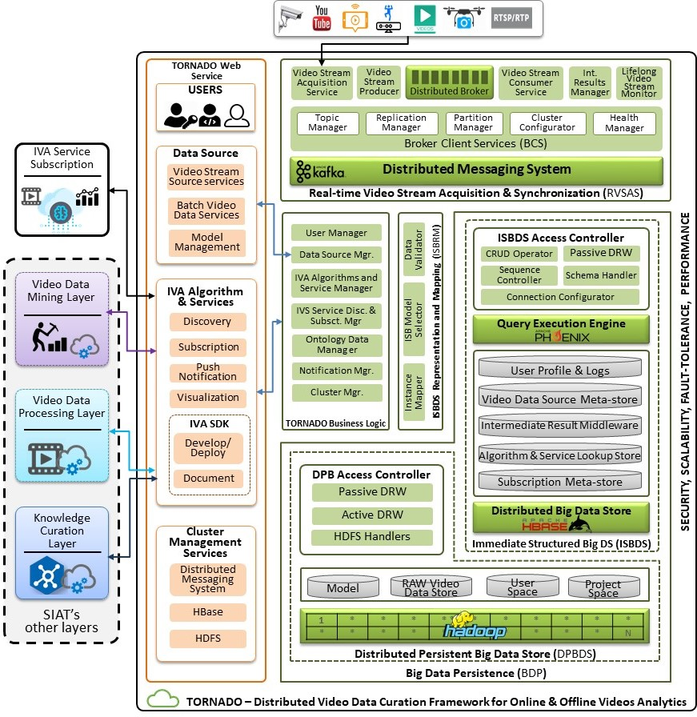
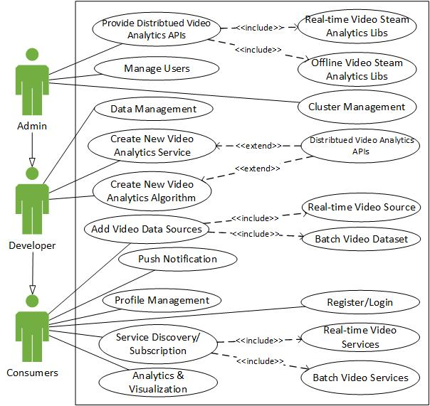
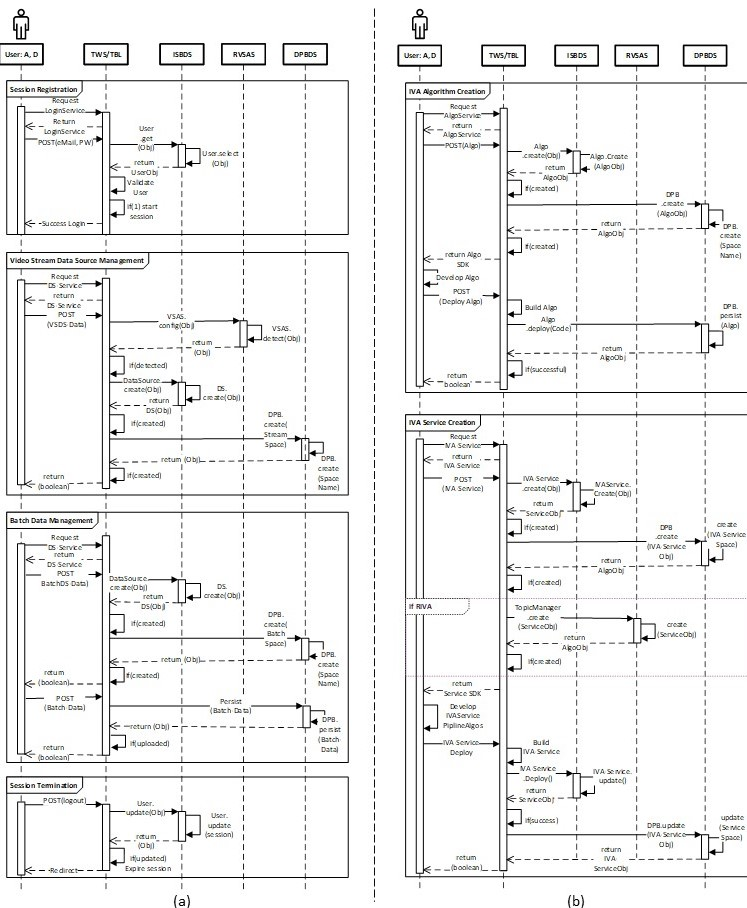

# **TORNADO** : Intermediate Results Orchestration based Data Curation Framework for Intelligent Video Big data Analytics in the Cloud

Big data technologies are software platforms designed for distributed computing to process, analyze, and extract the valuable insights from large datasets in a scalable and reliable way. **Cloud computing** is a model for enabling ubiquitous, convenient, and on-demand network access to a shared pool of configurable computing resources that can be rapidly provisioned and released with minimal management effort or service provider interaction. The cloud is preferably appropriate to offer the big data computation power required for the processing of these large datasets. For big data analytics, numerous cloud platforms have been developed, including IBM Big Data Analytics, Amazon web service, and many more. 

Recently, the deployment of distributed computing technologies in the cloud for video big data analytics has been the center of attraction in academics and industry. Data curation is the active management of data over its life cycle,  from creation, acquisition, and initial storage to the time when it is archived or becomes obsolete. Industrial **Cloud-Based Video Analytics System**, such as Checkvideo, Intelli-Vision, assist consumers with limited functionalities, i.e., real-time video analytics service subscription. Google released a cloud-based video intelligence APIs to generate video metadata  and provided it as a black box to the developer. It does not allow the developer/researcher to plug new video analytics algorithms or to extend its functionality. Likewise, the understanding, configuration, and operationalization of big data technologies for video analytics in the cloud are tedious and time-consuming, especially in an educational environment. The existing solutions also do not consider factors like the management of high-level and low-level features while deploying video analytics algorithms. Motivated by these limitations in existing work, we propose and implement a comprehensive intermediate results orchestration based service-oriented data curation framework for large-scale online and offline video analytics in the cloud known as **TORNADO**.

## Main Features

The main features of the **TORNADO** are: 
- **TORNADO** is a scale-out data curation framework for video big data analytics in the cloud and encompasses key components like role-based access controller, device-independent video stream acquisition and synchronization, lifelong video stream monitoring tool, and big data persistence. 

- **High-level abstraction** on top of big data technologies have been developed and optimized for video big data analytics to hide the complexity of big data stack.
    
 - The proposed TORNADO effectively resolves the data curation issues throughout the life cycle of the video analytics pipeline by developing distributed data management modules both for real-time and offline analytics.
    
- TORNADO provides **video analytics algorithms and service creation and publishing APIs** that enable developers and researchers to author and publish contextual and domain-specific video analytics algorithms and services. Which are made available to the developers while following as-a-service model 
    
- TORNADO provide a unified scale-out middleware called IR Middleware against to address issues like big dimensionality, intermediate results, and video analytics pipeline orchestration. 

## TORNADO - Archtecture
As illustrated in the following figure, TORNADO is composed of six components i.e., RVSAS, ISBDS, DPBDS, ISBRM, TORNADO Business Logic, and TORNADO Web Services.



### Real-time Video Stream Acquisition and Synchronization (RVSAS)
This component provides interfaces and acquire large-scale video streams from device-independent video stream sources for on-the-fly processing. The video stream sources are synchronized based upon the user identification and the timestamp of the video stream generation. Then, it is queued in the form of mini-batches in distributed stream buffer for near real-time video analytics. The video stream queued in the form of mini-batch can be accessed while using VSAS. During video analytics service pipelining, the **Intermediate Results** are maintained through **Intermediate Results Manager**. Similarly, **Real-time Stream Acquisition Service** is equipped with **LVSM** to provide a push-based notification response to the client with the help of a publish-subscribe mechanism. The extracted values (features and anomalies) and the actual video streams are then persisted into **ISBDS** and **DPBDS**, respectively.

### Immediate Structure Big Data Store (ISBDS)
ISBDS component is responsible for storing and managing large-scale structured data in a distributed environment according to the business logic implemented by **TORNADO Business Logic**. The structured data is related to users, access rights, VDPL, VDML, KCL, metadata of the video data stream sources, batch datasets, big models, and service subscription information. This module also orchestrate the **Intermediate Results** and anomalies being generated by a domain-specific video analytics service. According to the demands of TORNADO, two types of operations are required to be performed on the ISBDS, i.e., random read-write operation against the real-time queries and, bulk load and store operations for offline analytics. For such operations, we develop and deploy **ISBDS Access Controller** to access the underlying data securely against random and scan read-write operations.

### Distributed Persistent Big Data Storage (DPBDS)
DPBDS is built on top of HDFS and is responsible for providing permanent and distributed big data persistence to the raw video data, big models, and also supposed to maintain the actual video analytics plugins deployed by other layers. During the contextual distributed offline video analytics, batch video data and models are needed to be loaded. Similarly, different HDFS file operations are required, e.g., access permission, file creation, etc. In this context, we exploit the services of DPBDS Access Controller.  

### ISBDS Representation and Mapping (ISBRM)
ISBRM component is responsible for validating and mapping the contextual data to the respective data stores according to the business logic of TORNADO. TORNADO Business Logic hides the complexity of the proposed system by establishing a well-defined set of uniform and consistent operations. TORNADO Business Logic allow the users to utilize the functionality of the proposed framework over the web.

 ## User roles and use case diagram



 ## Sequence diagrams
 - The sequence diagram for session creation, video stream data source, and batch data management are shown in the following figure along with video analytics algorithm and service creation.
 - In the Actor lifeline **A** and **D** represent **Admin** and **Developer**, respectively. These two roles are allowed to create a new video analytics algorithm and service.

 
 

## Configuration 

### Environment setting
Download and deploy [Hortonworks Data Platform](https://www.cloudera.com/products/hdp.html) (HDP).  Configure the following frameworks while deploying HDF.
 1. [HDFS](https://hadoop.apache.org/docs/r1.2.1/hdfs_design.html)
 2. [Apache Hbase](https://hbase.apache.org/) and [Apache Phoenix](http://phoenix.apache.org/)
 3. [Apache Spark](https://spark.apache.org/)
 4. [Apache Kafka](https://kafka.apache.org/)
 5. [Apache Zookeeper](https://zookeeper.apache.org/)

Download and configure the TORNADO Framework using [Eclipse](https://www.eclipse.org/)
> ```
> git clone https://github.com/angry-bit/TORNADO.git

### Real-time Video Stream Acquisition & Synchronization variable settings 
Set the following variable in the **GlobalClusterConfigurations** interface as per the HDP deployment. 

> siat.dsl.data.acquisition.streaming.operations.client.configuration
>```
> public static String KAFKA_SERVER_HOST_NAMES = "node1,node2,node3";
> public static String ZOOKEEPER_SERVER_HOST_NAMES = "node1,node2,node3";
> public static final int ZOOKEEPER_SESSION_TIME_OUT_MS = 8000;
> public static final int ZOOKEEPER_CONNECTION_TIME_OUT_MS = 5000;
> public static final long TWO_SECONDS = 2000;

Modify the following **Real-time Video Stream Acquisition & Synchronization** Interfaces if required.
> IKafkaConsumerConstants
> IKafkaProducerConstants

### Immediate Structured Big data store model deployment 
ISBDS is provided to manage large-scale structured data in the distributed environment using Apache Phoenix. 

Modify the following variable as per Hbase/Phonenix deployment. 	

>```
> public String URl = ""; 
> public String driver = "org.apache.phoenix.queryserver.client.Driver";
> public String userName = "";
> public String password = "";
> public String dataBase= "siat";
>public Connection connection = null;

Use the following API to deploy the ISBDS schema. 

>```
> ModelHandler.deploySiatSchema();

# Comming Soon
1. TORNADO User Interface 
2. TORNADO Docker image
3. Video analytics services
